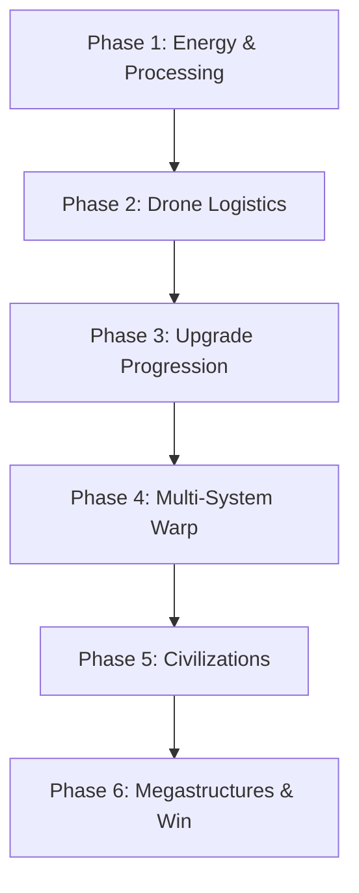

# Implementation Plan: Stellar Harvester (Roadmap & Technical Design)

This document outlines the step-by-step order in which the remaining features of Stellar Harvester should be
implemented. It aligns
with [GDD.md](file:///c:/Users/della/Documents/programacion/stargame/stargame/src/main/resources/GDD.md) and
incorporates design decisions regarding drone trajectory mechanics, warp physics, and manual harvesting.

## Implementation Phases

### Phase 1: Planetary Energy Grid & Processing Recipes

**Goal:** Establish resource consumption loops, power demands, and in-place automated manufacturing.

1. **Planetary Power Grid:**
    * Create an energy tracker on planets.
    * Add generators:
        * **Solar Array:** Power output scales inversely with the planet's orbital distance from the host
          star ($Output \propto 1/r^2$).
        * **Fusion Reactor:** High output; consumes $1 \text{ Hydrogen}$ per tick from local storage.
    * Implement **Brownout Logic**: If total machine demand exceeds installed capacity, calculate
      `Efficiency = Installed / Demand`. Scale facility tick operations (extraction & processing) by this efficiency
      multiplier.
2. **In-Place Manufacturing Facilities:**
    * Implement a recipe solver during tick execution (checking storage for inputs, deducting them, and depositing
      outputs).
    * Implement the following facilities:
        * **Alloy Smelter:** $2 \text{ Metals} \rightarrow 1 \text{ Alloy}$.
        * **Chemical Plant:** $1 \text{ Hydrogen} + 1 \text{ Water} \rightarrow 1 \text{ Coolant}$.
        * **Engine Fabricator:** $5 \text{ Alloys} + 2 \text{ Coolants} \rightarrow 1 \text{ Thruster}$.
3. **Research Laboratories:**
    * Add labs that consume raw resources on specific planet types to generate physicalized science packages:
        * Geological Lab (Rocky Planets) $\rightarrow$ Physical Science.
        * Biological Lab (Organic Planets) $\rightarrow$ Biological Science.
        * Gas Lab (Gas Giants) $\rightarrow$ Chemical Science.
        * Cryo-Physics Lab (Ice Giants) $\rightarrow$ Cryo-Physics Science.

---

### Phase 2: Hohmann Transfer Drone Logistics

**Goal:** Create automated system cargo links using physically simulated orbital transfer paths.

1. **Logistics Route Configuration:**
    * Store fields: `Origin`, `Destination`, `ItemType`, `BatchMode` (boolean), `Active` (boolean).
    * Update the planet info panel UI to configure, enable, or delete drone routes.
2. **Hohmann Transfer Trajectories:**
    * Drones do not fly in straight lines. They use elliptical Hohmann transfer orbits to transition between the
      circular orbits of the source and destination bodies.
    * On route start, calculate the transfer ellipse parameters, spawning a 3D logistics drone model that glides along
      the calculated ellipse towards the destination.
3. **Standby and Overflow Handle:**
    * Drones entering an overflowed destination planet orbit wait in `STANDBY_ORBIT` until storage opens up.
    * Fire a UI warning notification to alert the player.

---

### Phase 3: Research Tree & Ship Upgrades

**Goal:** Spend science products delivered to the Central Hub to unlock upgrades and navigate environmental hazards.

1. **Research Tree UI:**
    * Introduce a dedicated technology UI view displaying branches: Propulsion, Automation, Energy, and Diplomacy.
2. **Environmental Hazards (Thermal Shielding):**
    * Inner orbits close to stars deal thermal damage or block flight completely unless the player has unlocked *
      *Thermal Shielding I, II, or III**.
3. **Upgrade Integrations:**
    * **Propulsion:** Upgrades max flight speed, warp multiplier, and ship cargo capacity.
    * **Automation:** Upgrades drone speed and unlocks batch mode configurations.
    * **Energy:** Unlocks advanced generator recipes (Fusion, Antimatter).

---

### Phase 4: Physical Warp & Interstellar Exploration

**Goal:** Expand travel mechanics into a multi-system galaxy with physical warp navigation.

1. **Multi-System Engine Structure:**
    * Create a `Galaxy` structure that manages multiple independent `StarSystem` instances.
2. **Physical Warp Navigation:**
    * Immersive warp travel: The player aims their ship at a distant star system on the HUD/Map, holds a designated "
      Warp Drive" key, and charges the warp engine.
    * The system renders a warp speed effect, gradually transitioning the player out of the current system and loading
      the new system on arrival.
3. **Stellar Harvesting:**
    * Allow orbital placement of Stellar Harvesters to harvest **Star Matter** and **Exotic Energy** directly from the
      star's outer corona, gated by high-tier Thermal Shielding.

---

### Phase 5: Inhabited Planets & Alien Civilizations

**Goal:** Integrate alien factions offering trade, cross-system carrier logistics, and science bonuses.

1. **Civilization Factions:**
    * **Traders:** Offer resource exchange deals resetting daily, supporting counter-offers.
    * **Carriers:** Execute automated cross-system cargo transport for a cargo tax fee.
    * **Scientists:** Passively generate Science Products into local planetary storage.
    * **Isolationists:** Gate all planetary operations behind a 3-to-4 stage resource request chain.
2. **Cultural Investment:**
    * Players pay cultural tributes or construct Cultural Monuments on planets to raise civilization levels, unlocking
      higher route capacities and better rates.

---

### Phase 6: Megastructures & Activation Win Condition

**Goal:** Build massive orbital infrastructure projects culminating in a Dyson Sphere.

1. **Megastructure Construction Phases:**
    * Set up construction sites around host stars and planets. Construction progresses through distinct phases requiring
      massive quantities of Alloys, Coolant, and Exotic Energy.
    * Implement megastructures:
        * **Interstellar Relay:** Extends Carrier cross-system route ranges.
        * **Orbital Mega-Refinery:** Fast orbital resource smelter (10x surface rate).
        * **Orbital Research Array:** High-yield scientific synthesizer.
        * **Dyson Swarm / Sphere:** Harnesses stellar power to generate massive energy output.
2. **Win Condition:**
    * Activating the Dyson Sphere triggers the game's victory credits, followed by an option to continue playing in
      sandbox mode.
